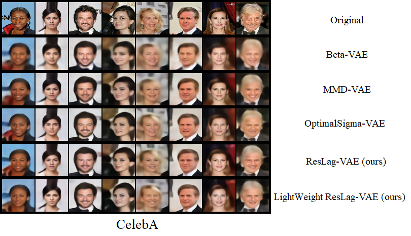
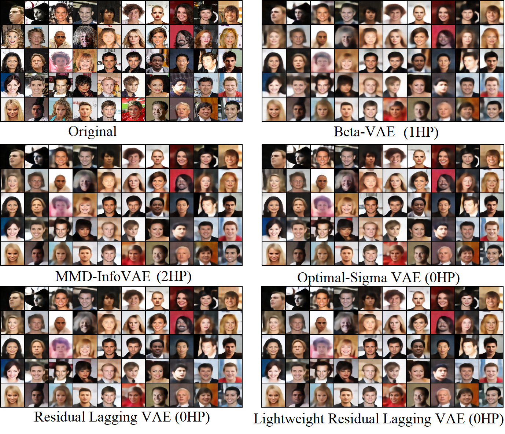
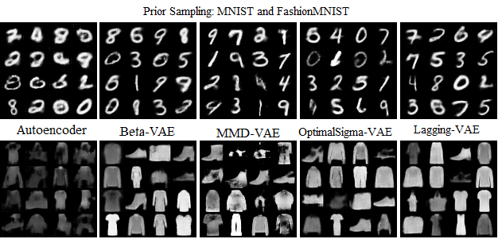
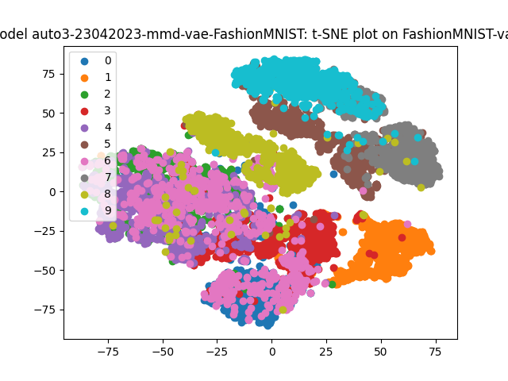
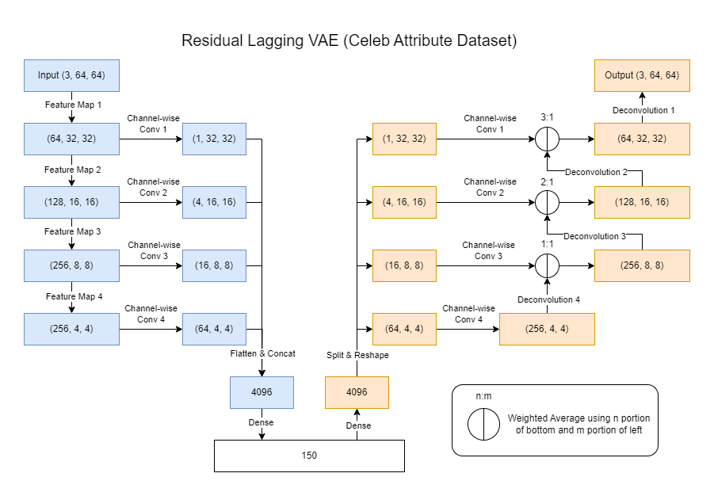
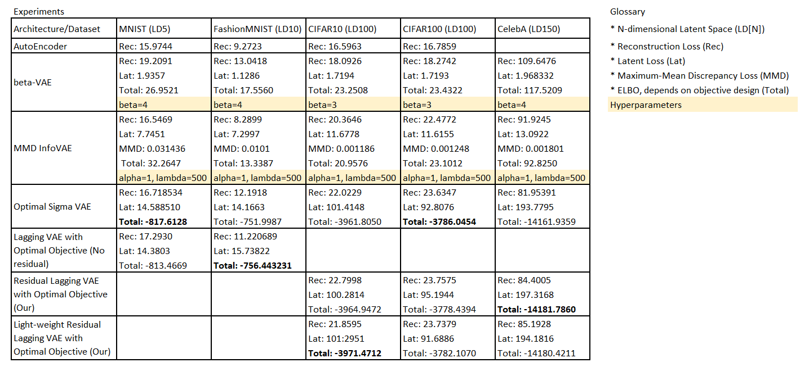

# VAE and GAN variants

This repository experiments with differnt VAE types on 5 datasets. Trained models can be downloaded
from [my Google Drive storage](https://drive.google.com/file/d/1jHDoZ6xaL10LD-wWIcOTIMfTnAlVy5XG/view?usp=sharing) and are ready to use. Results from my experiments can be replicated. Note that the sum of all models are about 4GB. 

If somehow you can't get the models from the link above, feel free to email me at `kh.boon2@gmail.com`. I will do my best to help you on this part. 

## Requirements

This program is tested on Python 3.9 on Windows 10 with an NVIDIA GEFORCE RTX 3060 GPU.

We recommend using a virtual environment in Python, name it as `./venv/`.

Install as below, note the cuda version, change accordingly to your machine.
```
pip install torch torchvision --index-url https://download.pytorch.org/whl/cu117
pip install -r requirements.txt
```
The torch versions on my machine at the time of writing is `torch==2.0.1+cu117,torchvision==0.15.2+cu117`.

## Run the web-UI
Use 
```
python launch.py
``` 
to launch the web-UI at the port 4896. Open "http://localhost:4896" in your browser, then you can
start using it. 

### About models

Training will always create new models based on the "Model Name" parameter.
Current cannot train model with a used "Model Name". 

Models will be saved in `./models/{Model Name}/`. 
The Model Name does not have to contain anything meaningful, since all 
useful configuration will be stored in `./models/{Model Name}/config.json`. 

## How to use models

After downloading the pretrained models, put it in the `./models/` folder. 
Go to Web UI, on the Model Inferencing tab, select model. Anything else will be selected for you
by default. On the right-hand side you can play around with the following features:
- Bulk Inferencing
- Prior Sampling
- Latent Interpolation (from 2 or 4 images)
- Latent Traversal
- Single Image Inferencing

On the Inspect Model tab, each model's training metrics can be viewed.

We provide t-SNE analysis for MNIST and Fashion MNIST dataset in its tab. 

## Some results

Among the illustrations below, our models are termed "ResLag-VAE".

Model Reconstruction comparisons


Prior Sampling on CelebA


Prior sampling on MNIST and Fashion MNIST


T-SNE graph on Fashion MNIST dataset


Our model's architecture


Quantitative results
